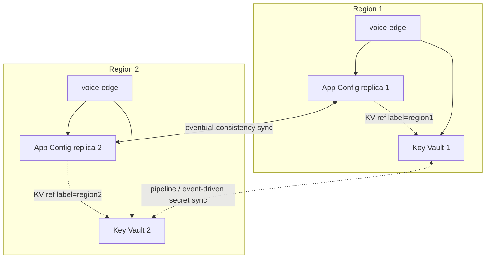

# ADR-0000 — Azure App Configuration and Key Vault strategy

- **Status:** Draft
- **Date:** 2026-06-26

## Context

## KeyVault Considerations
* Key Vault geo-redundancy enables high durability of your key and secret data, which protects against hardware failures, network outages, or localized disasters.

* Per vault per region - max 4k transactions per 10 seconds

* Microsoft triggers Microsoft-managed failover. It's likely to occur after a significant delay and is done on a best-effort basis. There are also some exceptions to this process. The failover of key vaults might occur at a time that's different from the failover time of other Azure services.

* Downtime: While the failover is in progress, your key vault might be unavailable for a few minutes.

* Read-only after failover: After failover, the key vault becomes read-only and only supports limited actions. You can't change key vault properties while operating in the secondary region, and access policy and firewall configurations can't be modified while operating in the secondary region.

When your key vault is in read-only mode, only the following operations are supported:

List certificates
Get certificates
List secrets
Get secrets
List keys
Get (properties of) keys
Encrypt
Decrypt
Wrap
Unwrap
Verify
Sign
Backup
Behavior during a region failure
The following section describes what to expect when a key vault is located in a region that supports Microsoft-managed replication and failover and there's an outage in the primary region:

Detection and response: Microsoft can decide to perform a failover if the primary region is lost. This process can take several hours after the loss of the primary region, or longer in some scenarios. Failover of key vaults might not occur at the same time as other Azure services.
Notification: Microsoft doesn't automatically notify you when a zone is down. However, you can use Azure Resource Health to monitor for the health of an individual resource, and you can set up Resource Health alerts to notify you of problems. You can also use Azure Service Health to understand the overall health of the service, including any zone failures, and you can set up Service Health alerts to notify you of problems.
Active requests: During a region failover, active requests might fail, and client applications need to retry them after the failover completes.

Expected data loss: There might be some data loss if changes aren't replicated to the secondary region before the primary region fails.

Expected downtime: During a major outage of the primary region, your key vault might be unavailable for several hours or until Microsoft initiates failover to the secondary region.

If you use Private Link to connect to your key vault, it might take up to 20 minutes for the connection to be re-established after the region failover.

Traffic rerouting: After a region failover completes, requests are automatically routed to the paired region without requiring any customer intervention.

## Suggestion
For an active-active footprint (2 today, up to 4), use **one Key Vault per active region** plus **App Configuration geo-replication (one replica per region)**. Do **not** rely on Key Vault's native read-only paired-region DR as your multi-region mechanism — it's a single-region business-continuity safety net, not an active-active serving tier.

Three facts from the platform docs make this decisive for your case:

1. **Key Vault's native DR gives you exactly one secondary, in a fixed paired region, that is read-only and only fails over on a Microsoft-triggered basis that "can take several hours… or longer."** That cannot serve a 2–4 region active-active mesh, and the read-only secondary can't take writes (rotation, access-policy, firewall changes all blocked).
2. **Key Vault throttling is per-vault.** Microsoft explicitly recommends *"divide your Key Vault traffic among multiple vaults and different regions… a separate vault for each security/availability domain."* Pointing 4 active regions at one vault risks 429s on a single regional throttle budget.
3. **App Configuration geo-replication** is the supported multi-region pattern: one store, a replica per region, each replica has its **own endpoint and its own isolated request quota**, eventual-consistency sync, and the .NET provider does **automatic replica discovery + failover**.

This also aligns with ADR‑0010, which already treats each region as independently resilient ("each cluster needs its own Cognitive Services link", cluster-local fallback). Per-region Key Vault is the same principle applied to secrets.

## Native DR vs. vault-per-region

| Dimension | Native read-only paired-region DR | **Key Vault per region (recommended)** |
|---|---|---|
| Active regions served | 1 primary + 1 read-only pair | N (scales to 4+ linearly) |
| Failover | Microsoft-triggered, hours, read-only | You control; each region independent |
| Write availability during a region loss | None (secondary is read-only) | Unaffected regions stay read/write |
| Throttle budget | One vault's budget shared by all regions | Per-region budget, no cross-region contention |
| Latency | Cross-region for non-primary regions | Region-local |
| Region choice | Fixed Azure pair; some regions unsupported | Any region you deploy to |
| Sync burden | Microsoft-managed | You sync (pipeline / event-driven) |

You still get native zone redundancy and the paired-region replica **for free on each regional vault**, so per-region vaults are belt-and-suspenders, not a downgrade.

## App Config → Key Vault references

An App Configuration **Key Vault reference stores the full secret URI** (e.g. `https://<my-vault>.vault.azure.net/secrets/...`) and the app resolves that exact URI at runtime. Because geo-replication copies **identical** key-values to **every** replica, a single reference value means **all regions resolve from the same one vault** — re-introducing the cross-region dependency and throttling risk you're trying to remove.

Pick one of these to break that coupling:

- **Option A — label-scoped references (single geo-replicated App Config + per-region vaults).** Store the same key once per region using a region **label**, each pointing to that region's vault URI. Geo-replication still copies all labels everywhere, but each region's app loads only its own label. One App Config store, region-local vault resolution.
- **Option B — App Config store per region (not geo-replicated).** Each region's store has references to its local vault. More moving parts; lose single-pane management; only choose if you want hard data-flow isolation between regions.
- **Option C — single vault, accept cross-region resolution.** Simplest, and the provider/`SecretClient` cache resolved secrets in memory (resolution happens at load/refresh, not per request), so latency is amortized. But you keep a single-region dependency and one throttle budget — not advisable at 4 active regions.

For a hyperscale active-active contact center, **Option A** is the sweet spot (region-local reads, one config surface). Option B if you need strict per-region compartmentalization.

## Recommended target topology

Repeat the region block for regions 3–4. Each region's app primarily uses its local App Config replica and local vault, and fails over to another replica if its local one is down.

## Keeping secrets consistent across vaults

- **Region-specific secrets** (per-region ACS resource keys, per-region Cognitive Services / Speech keys per ADR‑0010) live only in that region's vault — nothing to sync.
- **Truly global secrets**: make the **pipeline/IaC the source of truth** and write them to every regional vault on deploy (configuration-as-code). For rotation, drive an event-based fan-out: Key Vault `SecretNewVersionCreated` → Event Grid → Function/Logic App that copies the new version to peer vaults. Don't use Key Vault backup/restore for live sync — it's a point-in-time snapshot that doesn't auto-update.

## Concrete settings

- **Both services**: deploy only into **availability-zone regions** — App Config replicas and Key Vault are zone-redundant automatically and free.
- **Key Vault**: enable **soft-delete + purge protection**; use `SecretClient` with exponential-backoff retry and **in-memory caching** (cache, re-read only on rotation) to stay under per-vault limits.
- **App Configuration**: use the .NET provider with **automatic replica discovery/failover**, a sensible **refresh interval**, and a **sentinel key** to avoid request amplification across your pod fleet. Standard or Premium tier (geo-replication isn't in Free/Developer).
- **Your AppHost wiring**: today Program.cs binds a single `appconfig` and single `secrets` vault via `AsExisting(...)` with one `keyVaultName` / `appConfigName` parameter. To go multi-region, parameterize these per region (each region's deployment supplies its own `keyVaultName` and its App Config **replica endpoint**), following the existing `AsExisting(nameParam, rgParam)` pattern in ParameterNameConstants.cs.

## AKS Considerations

For **disk CMK** (OS/data disks and CSI persistent volumes via a `DiskEncryptionSet`), Microsoft's rule is explicit:

> "Managed disks and the Key Vault or managed HSM must be in the **same Azure region**."

A `DiskEncryptionSet` is region‑scoped and AKS requires it to be in the same region as the cluster. So a single Key Vault in region 1 **cannot legally back region 2's disk encryption at all** — region 2 needs its own DES pointing at a same‑region vault. "One vault for two regions, relying on geo‑redundancy" is only even achievable for **KMS etcd encryption** (where a remote vault is technically allowed but not recommended) or plain app secrets — not disk CMK.

### What happens when the primary region (hosting the vault) goes down

**1. Both regions lose the key at the same time — region 2 is collateral damage.**
Your active‑active premise (ADR‑0010: a region event is absorbed by the survivor) is exactly what breaks. The healthy region‑2 cluster's encryption dependency lives in the dead region‑1 vault, so region 2 degrades precisely when you need it to absorb region 1's traffic. The vault becomes a cross‑region single point of failure.

**2. Geo‑redundancy is durability, not fast availability — expect a multi‑hour window.**
The paired‑region copy only becomes usable after a **Microsoft‑triggered** failover that "can take several hours… or longer," and you cannot force it. Until then, every wrap/unwrap call to the vault fails. (Even after failover it's **read‑only**, and Private Link reconnection can take up to ~20 minutes.)

**3. What concretely breaks during that window:**

- **Disk CMK:** Azure Storage can't unwrap the DEK. Documented behavior when the key becomes inaccessible: disk I/O **starts failing ~1 hour** later, and VMs "automatically shut down" and "won't boot until the key is enabled again." AKS nodes are VMSS VMs — so nodes in the affected scope go down about an hour into the outage, and any *immediate* key operation (new node provisioning, scale‑out, node repair/reimage, reboot, PV attach/detach) fails right away.
- **KMS etcd encryption:** kube‑apiserver can no longer decrypt etcd → **secret read/write fails**, cascading to anything backed by secrets (pod secret mounts, service‑account tokens, image‑pull secrets, TLS). A cached DEK may delay this, but an API‑server restart or cache expiry triggers it. (And note the AKS warning: permanent key loss can require **cluster recreation**.)
- **Autoscale and self‑heal are broken in both regions** — you can't add CMK‑encrypted nodes anywhere, which is the worst possible time for it.

**4. Read‑only limits even after failover.** Once Microsoft fails over, unwrap resumes, but you **can't rotate the key, change access policies/RBAC, or modify firewall rules**. If any of those is part of your recovery, you're blocked.

**5. Possible data loss (RPO > 0).** Replication is asynchronous, so a key version created shortly before the outage (e.g., a just‑rotated key) may not have replicated — anything wrapped with it can't be unwrapped.

**6. Your RTO is at Microsoft's discretion**, not yours — unacceptable for a hyperscale active‑active call platform.

### Recommendation

Treat CMK keys like the per‑region, region‑pinned resources they are — **not** like the syncable app secrets from the rest of this ADR:

- **One Key Vault + one `DiskEncryptionSet` + one KMS key per region**, each referencing the local vault, with a regional managed identity (`wrapKey`/`unwrapKey`/`get` for the DES; `encrypt`/`decrypt` for KMS).
- Keys can be **independent per region** — encryption‑at‑rest doesn't require identical key material across regions. If a compliance policy mandates the same key bytes everywhere, **import the same BYOK (HSM‑backed) key** into each regional Premium vault rather than sharing one vault.
- Keep each vault **zone‑redundant** (automatic) and **enable soft‑delete + purge protection** (required for disk CMK), plus per‑region auto‑rotation. The paired‑region geo‑redundancy then remains a per‑vault *durability* backstop, not your active‑active mechanism.

This keeps each region fully self‑sufficient for encryption, consistent with ADR‑0010's "each cluster carries its own regional dependencies" principle — and it's the same per‑region conclusion your draft already reaches for App Config + Key Vault, with the added wrinkle that for disk CMK the per‑region vault is **mandatory**, not just advisable.

