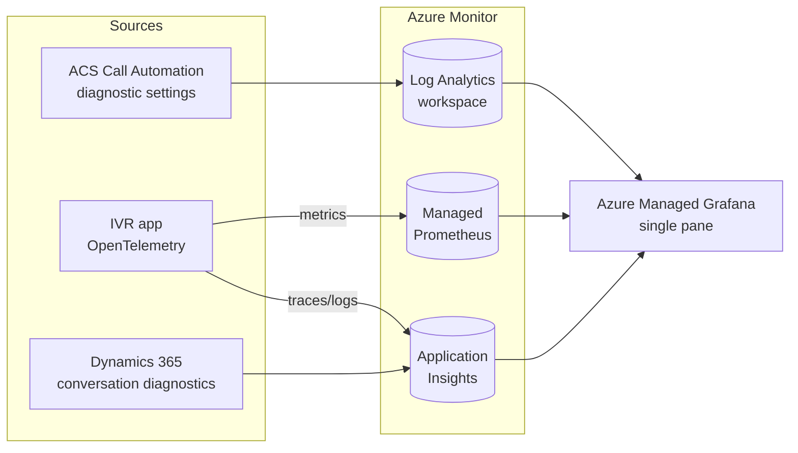

# Contact-Center End-to-End Monitoring

A single pane of glass for calls that traverse **Teams Phone → Azure Communication Services (ACS, via Teams Phone Extensibility) → the IVR app → Dynamics 365 Contact Center**, with end-to-end call correlation across every boundary.

This folder is the design reference for that observability plane. The monitoring
library is present, but the composed application and cross-platform correlation
are not yet validated end to end. Start here, then follow the links.

| Document | What it covers |
|---|---|
| [correlation-model.md](correlation-model.md) | The canonical `e2e_call_id` / `context_id` contract, the OpenTelemetry attribute keys, and how identifiers flow and are joined across ACS ↔ IVR ↔ D365. |
| [setup.md](setup.md) | How to light up each source: ACS diagnostic settings, Dynamics 365 conversation diagnostics export, the IVR enrichment, and the Azure Managed Grafana single pane. |
| [queries.md](queries.md) | The KQL join queries — reconstruct one call as a single ordered timeline, reconcile transfers, and see live health. |
| [dashboards.md](dashboards.md) | The Grafana dashboard model and its panels/variables. |
| [panel-library.md](panel-library.md) | Authoring reference for the reusable panel library — file anatomy, naming/visualization conventions, and how to add a panel or dashboard. |
| [high-availability.md](high-availability.md) | Adoption guide: compare monitoring HA/DR options, choose regional/global destinations, understand costs, and plan recovery. |
| [monitoring-costs.md](monitoring-costs.md) | Source volume estimates and links to the HA/DR cost model; not a measured bill. |

## The core idea (and its one honest constraint)

True distributed tracing (W3C `traceparent` propagation) only exists **inside the IVR application**. The platforms on either side do **not** emit your OpenTelemetry spans:

- **Teams Phone** exposes call quality/usage through CQD and Microsoft Graph call records — post-call datasets, not real-time spans.
- **ACS** exposes Call Automation **resource logs** through Azure Monitor diagnostic settings.
- **Dynamics 365 Contact Center** exposes **conversation diagnostics** into Application Insights `Traces`.

So "one trace across four boundaries" is realistically a **canonical-ID join** across heterogeneous sources:

- **Deterministic** across ACS ↔ IVR ↔ D365, because the IVR mints a canonical id at ingress and carries a `context_id` across the transfer.
- **Probabilistic** at the Teams edge (join on called DID + hashed caller number + time window), deferred to a later phase.

## Architecture at a glance

- **Log Analytics workspace** — ACS Call Automation logs (and, later, the Teams Graph ETL).
- **Application Insights** — IVR traces/logs **and** D365 conversation diagnostics. Sharing a workspace simplifies the single-call query, but also shares a regional failure boundary. The [HA/DR proposal](high-availability.md) compares this with regional components/workspaces and federated queries; it is not deployed behavior.
- **Azure Monitor Managed Prometheus** — IVR metrics (RED/USE).
- **Azure Managed Grafana** — the single pane; queries all of the above through the built-in Azure Monitor data source via managed identity.

## What is implemented in this repo

- **[Monitoring library](../../code/Agents.AI.Monitoring/)** - source for the
  correlation and observability integration, plus reference assets. See
  [dashboards.md](dashboards.md) for the dashboard design; source presence is
  not deployment evidence.
- **[Service defaults](../../code/ContactCenter.ServiceDefaults/Extensions.cs)** -
  generic OpenTelemetry instrumentation and optional OTLP export. The current
  helper does **not** call `AddCallCorrelation()` or automatically compose the
  full contact-center enrichment pipeline.
- **[Standard contact-center facade](../../code/Agents.AI.ContactCenter/DependencyInjection/StandardContactCenterExtensions.cs)** -
  registers correlation services, but a host must still initialize and propagate
  call context at ingress, callbacks, media connections, and transfer boundaries.
- **[Banking demo coordinator](../../code/ContactCenter.AIAgent/Services/CallCoordinator.cs)** -
  initializes and propagates call context around ingress, media, callbacks, and
  transfer. The host uses service defaults and the standard contact-center facade.
  [Local host tests](../evidence/2026-09-09-banking-demo-validation.md) do not
  validate exported telemetry or live cross-platform joins.
- **[AppHost](../../code/ContactCenter.AppHost/AppHost.cs)** - environment-specific
  resource composition remains separate from this demo. Existing user composition
  work is preserved; no monitored Azure deployment is established by these tests.

The rest of this folder describes the target integration. Verify it against the
[current implementation map](../README.md#current-implementation) and
[evidence limitations](../evidence/2026-09-08-code-adoption-validation.md#limitations)
before relying on automatic enrichment or an end-to-end timeline.

For regional incidents, start with the [telemetry recovery entry point](../runbooks/monitoring/high-availability.md)
and [proposed ADR-0017](../adr/0017-telemetry-high-availability-and-disaster-recovery.md).
Do not assume LAW replication also protects Application Insights, Container Insights, managed Prometheus, Grafana, or alert resources.

## Scope

- **MVP:** deterministic ACS → IVR → D365 correlation.
- **Deferred (Phase 2):** the Teams Phone leg (Microsoft Graph call-records collector + probabilistic join).
- **Not covered here:** media-quality/MOS analytics and cross-tenant SIP transfer (the same-tenant VoIP path is the default).
