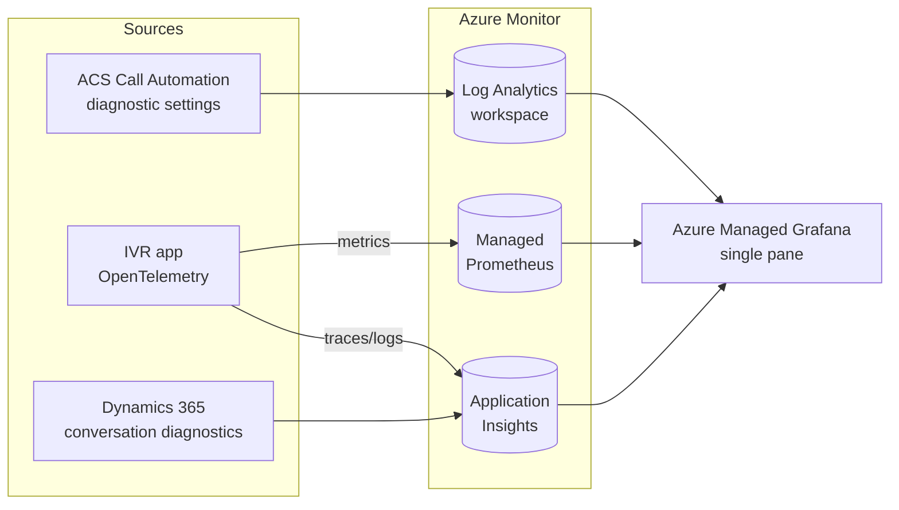

# Contact-Center End-to-End Monitoring

A single pane of glass for calls that traverse **Teams Phone → Azure Communication Services (ACS, via Teams Phone Extensibility) → the IVR app → Dynamics 365 Contact Center**, with end-to-end call correlation across every boundary.

This folder is the implementation reference for that observability plane. Start here, then follow the links.

| Document | What it covers |
|---|---|
| [correlation-model.md](correlation-model.md) | The canonical `e2e_call_id` / `context_id` contract, the OpenTelemetry attribute keys, and how identifiers flow and are joined across ACS ↔ IVR ↔ D365. |
| [setup.md](setup.md) | How to light up each source: ACS diagnostic settings, Dynamics 365 conversation diagnostics export, the IVR enrichment, and the Azure Managed Grafana single pane. |
| [queries.md](queries.md) | The KQL join queries — reconstruct one call as a single ordered timeline, reconcile transfers, and see live health. |
| [dashboards.md](dashboards.md) | The Grafana dashboard model and its panels/variables. |
| [panel-library.md](panel-library.md) | Authoring reference for the reusable panel library — file anatomy, naming/visualization conventions, and how to add a panel or dashboard. |

## The core idea (and its one honest constraint)

True distributed tracing (W3C `traceparent` propagation) only exists **inside the IVR application**. The platforms on either side do **not** emit your OpenTelemetry spans:

- **Teams Phone** exposes call quality/usage through CQD and Microsoft Graph call records — post-call datasets, not real-time spans.
- **ACS** exposes Call Automation **resource logs** through Azure Monitor diagnostic settings.
- **Dynamics 365 Contact Center** exposes **conversation diagnostics** into Application Insights `Traces`.

So "one trace across four boundaries" is realistically a **canonical-ID join** across heterogeneous sources:

- **Deterministic** across ACS ↔ IVR ↔ D365, because the IVR mints a canonical id at ingress and carries a `context_id` across the transfer.
- **Probabilistic** at the Teams edge (join on called DID + hashed caller number + time window), deferred to a later phase.

## Architecture at a glance

- **Log Analytics workspace** — ACS Call Automation logs (and, later, the Teams Graph ETL).
- **Application Insights** — IVR traces/logs **and** D365 conversation diagnostics. Sharing one App Insights/Log Analytics workspace across the IVR and D365 makes the single-call-trace query a single-workspace union.
- **Azure Monitor Managed Prometheus** — IVR metrics (RED/USE).
- **Azure Managed Grafana** — the single pane; queries all of the above through the built-in Azure Monitor data source via managed identity.

## What is implemented in this repo

- **`Agents.AI.Monitoring`** — the observability library: the correlation contract, the ambient accessor + store, the OpenTelemetry enrichment processor, the D365 context-variable map, the transfer-header builder, and the shipped KQL + PromQL + Grafana assets. The Grafana assets are a **reusable panel library** (`Dashboards/panels/`) composed by `build/assemble-dashboards.ps1` into several purpose-built dashboards (fleet live-ops, telephony/ACS, GenAI/realtime, transfer/routing, platform health) plus the original E2E single pane — see [dashboards.md](dashboards.md).
- **`ServiceDefaults.ConfigureOpenTelemetry`** calls `AddCallCorrelation()`, so every service stamps the canonical ids onto its spans/logs automatically.
- **The IVR ingress** (`CallingApi`) mints the `e2e_call_id` at the ACS `IncomingCall`, persists it, and re-hydrates it on every callback.
- **The transfer path** (`AcsCallControl` + `CallControlTools`) carries the `context_id` to Dynamics 365 as ACS custom-calling-context headers.
- **`AppHost.AddMonitoring()`** runs the OSS OpenTelemetry stack for local development and is a no-op in publish mode (where Azure Monitor + Managed Grafana take over).

## Scope

- **MVP:** deterministic ACS → IVR → D365 correlation.
- **Deferred (Phase 2):** the Teams Phone leg (Microsoft Graph call-records collector + probabilistic join).
- **Not covered here:** media-quality/MOS analytics and cross-tenant SIP transfer (the same-tenant VoIP path is the default).
