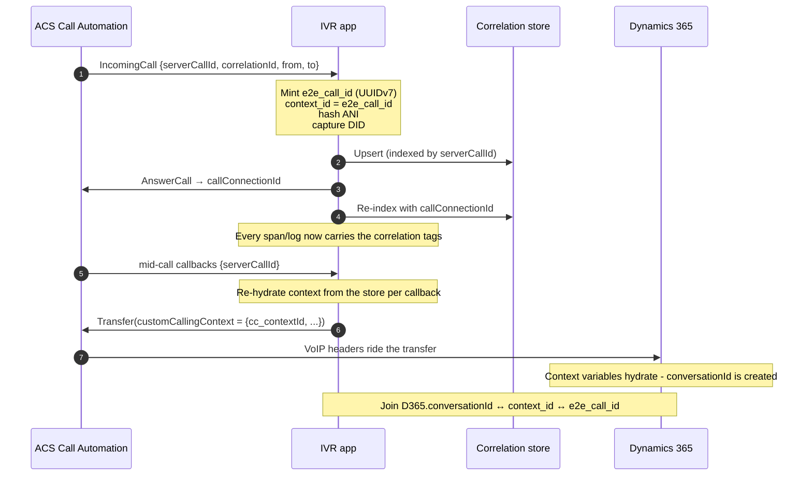

# Correlation Model

How a single call is stitched together across ACS, the IVR app, and Dynamics 365. This is the contract every dashboard and query depends on.

## Identifiers

| Identifier | Owner | Stability | Purpose |
|---|---|---|---|
| `e2e_call_id` | **The IVR (us)** | Minted once, immutable | Canonical id for the whole call. A UUIDv7 (RFC 9562) — a standard `Guid` with a millisecond timestamp in the high bits, so it is time-ordered by construction. |
| `context_id` | The IVR | Immutable | Durable lookup key carried **across the transfer** into D365. Defaults to `e2e_call_id`. |
| `serverCallId` | ACS | Stable per call | Identifies the ACS call. Available at the `IncomingCall`. |
| `callConnectionId` | ACS | Stable per connection | Preferred join key against ACS logs. |
| `correlationId` | ACS | **Can change mid-call** | Kept for support cross-reference only — never the primary key. |
| `conversationId` | D365 | Stable per conversation | The D365 work-item id, surfaced in conversation diagnostics. |

> **Why we mint our own id:** no single platform-issued id spans Teams Phone, ACS, and D365. `correlationId` can even change during a call. So we own a canonical `e2e_call_id` and map every platform id to it.

Join stably on `callConnectionId` / `serverCallId`, never on `correlationId`.

## OpenTelemetry attribute keys

The IVR stamps these onto every span and log (`Agents.AI.Monitoring/Correlation/CallCorrelationContext.cs` → `CallCorrelationTags`). Via the Azure Monitor exporter they surface as App Insights `customDimensions`, which is what the KQL queries read.

| Attribute key | Meaning |
|---|---|
| `e2e.call_id` | Canonical end-to-end call id |
| `call.context_id` | Transfer context id |
| `acs.server_call_id` | ACS server call id |
| `acs.call_connection_id` | ACS call-connection id (stable join key) |
| `acs.correlation_id` | ACS correlation id |
| `call.ingress_traceparent` | W3C traceparent of the IncomingCall span, so the (separate) media-streaming trace can link back to ingress |
| `d365.conversation_id` | Dynamics 365 conversation id (set once known) |
| `caller.ani_hash` | SHA-256 hash of the caller number (no raw EUII in telemetry) |
| `call.called_did` | The called DID / DNIS |
| `d365.workstream`, `d365.queue` | Routing targets |
| `call.intent`, `call.language` | Detected intent / caller language |

**Cardinality rule:** `e2e.call_id` and `caller.ani_hash` are high-cardinality. Keep them on **traces and logs only** — never as metric dimensions.

**Resource-scoped context.** Alongside the per-call ids above, `ServiceDefaults` stamps OpenTelemetry **resource** attributes on every signal — `service.name`, `service.instance.id`, `deployment.environment`, and (from the AKS downward API) `k8s.pod.name` / `k8s.namespace.name` / `k8s.node.name` / `k8s.cluster.name`. These answer *which pod/instance/environment* handled a call, which matters because the pod that answered `IncomingCall` may not be the pod that owns the media WebSocket (ADR-0011).

## Two traces per call: IncomingCall vs. media streaming

A realtime call produces **two independent inbound requests** to the IVR — the `IncomingCall` webhook and the media-streaming WebSocket upgrade — and therefore two separate traces. ACS is the client for both and does **not** propagate W3C trace context between them, so they cannot be joined by `traceparent`. They are stitched two ways:

- **Business-key join (always):** the WebSocket carries `x-ms-call-connection-id`; the IVR hydrates the ambient correlation context from it *before* accepting the socket, so every span/log on the media leg (including failures in accept/ownership/property-fetch) carries `e2e.call_id`.
- **Span link (navigable):** the ingress span's `traceparent` is persisted as `call.ingress_traceparent`; the WebSocket request span adds an `ActivityLink` to it, so the two traces are clickable-linked in App Insights/Grafana.

For an upgrade that fails at the **ingress** layer (Front Door / APIM / Istio) and never reaches the app, the WSS URL also carries `?serverCallId=…`, so a proxy 4xx access log can be joined back to the call — see [queries.md](queries.md).

## Lifecycle — where the ids come from and go

1. **Ingress mint** — at the ACS `IncomingCall`, the IVR mints `e2e_call_id`, hashes the caller ANI, records the DID, and persists the context (`CallingApi.cs`).
2. **Enrichment** — `AddCallCorrelation()` (wired in `ServiceDefaults`) registers an OpenTelemetry processor that stamps the tags onto every span from the ambient context.
3. **Re-hydration** — because each ACS webhook is a fresh, stateless request, the IVR re-loads the context from the store (keyed by `serverCallId` / `callConnectionId`) at the top of each callback and at the media-WebSocket session start.
4. **Transfer propagation** — see below.

## Carrying `context_id` across the transfer

When the IVR escalates to Dynamics 365, it attaches the correlation payload to the ACS transfer as **custom calling context** (`Agents.AI.Monitoring/Dynamics/TransferContextHeaderBuilder.cs`):

- **Same-tenant blind transfer to a phone number** → **VoIP headers** (Microsoft calling backbone; no SIP signaling). All correlation keys ride along.
- **Teams / consultative (potentially cross-tenant or SBC)** → **SIP** transfer; only the compact `context_id` goes in the SIP **UUI** (the full payload stays in the correlation store).

The header keys are the D365 **context-variable names** (`Agents.AI.Monitoring/Dynamics/D365ContextVariableMap.cs`), so Dynamics reads them 1:1:

| Header / D365 context variable | Source |
|---|---|
| `cc_contextId` | `context_id` (primary join key) |
| `cc_e2eCallId` | `e2e_call_id` |
| `cc_intent` | detected intent |
| `cc_lang` | caller language |
| `cc_workstream` | target workstream hint |

D365 context-variable names are **case-sensitive and must match exactly**; names ≤ 100 chars, values ≤ 4,000 chars. See [setup.md](setup.md#dynamics-365-side) for how to declare them.

## The correlation store

`ICallCorrelationStore` persists the `e2e_call_id ↔ {serverCallId, callConnectionId, context_id}` mapping and re-resolves any of them via `GetByCallKeyAsync`.

- **In-memory** (default) — fine for single-instance/dev.
- **Redis** — opt in with `AddRedisCallCorrelationStore()` for cross-pod, durable correlation. Recommended in production so ingress and later webhooks that land on different pods resolve the same context.

## What crosses each boundary

| Boundary | Carrier | Deterministic? |
|---|---|---|
| IVR internal | OpenTelemetry span/baggage | Yes |
| IVR → ACS logs | `callConnectionId` / `serverCallId` on both sides | Yes |
| IVR → D365 | `context_id` in ACS custom calling context → D365 context variable | Yes |
| Teams → ACS | called DID + hashed ANI + time window | Probabilistic (Phase 2) |
