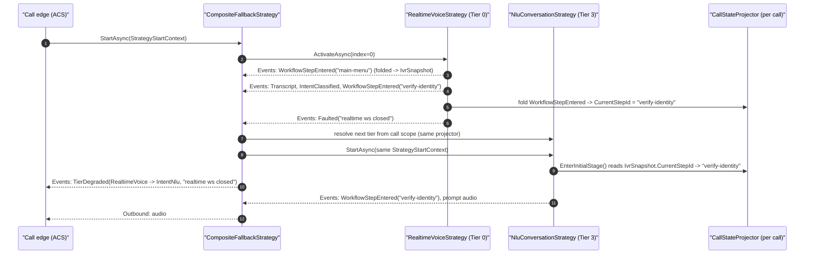

# Conversation strategies

> Imported design reference. The historical implementation lived under
> `src/AgentFramework/Agents.AI.ContactCenter/Calling/` in the source showcase;
> it has not yet been migrated into this repository's `code/` folder.
> Companion ADR: [ADR-0008 — Graceful degradation: Realtime → DTMF](../adr/0008-graceful-degradation-realtime-to-dtmf.md).

A **conversation strategy** is the "brain" of an active call. The call session owns the caller edge (ACS Call Automation, media-streaming WebSocket, DTMF callbacks) and delegates *what to say next* to a single `IConversationStrategy`. Strategies do not own a socket — they read inbound frames and DTMF from channels the session hands them, and they write `OutboundDirective`s and `StrategyEvent`s back to channels the session pumps to the edge and to observers.

Per-call wiring is built up in `CallSessionContainerExtensions`:

```csharp
builder.AddCallSessionContainer()
    .AddRealtimeVoiceStrategy(realtimeAgentServiceKey: AgentConfig.TriageAgent)  // Tier 0
    .AddNluStrategy()                                                            // Tier 3
    .AddDtmfStrategy()                                                           // Tier 4
    .AddCallControlTools()
    .AddCallerAuthentication()
    .AddCallerAuthenticator<AniIdentityLookupAuthenticator>()
    .AddTransferEscalationTarget(ShowcaseWorkflowIds.DefaultEscalationNumber)
    .AddCompositeFallbackStrategy(
        topTier: AgentTier.RealtimeVoice,
        AgentTier.RealtimeVoice, AgentTier.IntentNlu, AgentTier.DtmfOnly);
```

## The contract

```csharp
public interface IConversationStrategy : IAsyncDisposable
{
    StrategyKind Kind { get; }
    AgentTier Tier { get; }
    IvrSnapshot WorkflowState { get; }               // folded slice, projector-backed, survives tier swaps
    EdgeCapabilities EmittedDirectives { get; }
    ChannelReader<OutboundDirective> Outbound { get; }
    ChannelReader<StrategyEvent> Events { get; }

    Task StartAsync(StrategyStartContext context, CancellationToken ct = default);
    ValueTask PrewarmAsync(IServiceProvider services, CancellationToken ct = default);
    Task StopAsync(CancellationToken ct = default);
    ValueTask SuspendAsync(CancellationToken ct = default);
    ValueTask ResumeAsync(CancellationToken ct = default);
}
```

`StrategyStartContext` is the call-scoped "everything you need" record:

```csharp
public sealed record StrategyStartContext
{
    public required string CallId { get; init; }
    public required ChannelReader<AudioFrame> InboundAudio { get; init; }
    public required ChannelReader<DtmfTone>   InboundDtmf  { get; init; }
    public CallEdgeMetadata?    CallerMetadata { get; init; }
    public CallStateProjector?  StateProjector { get; init; }  // the call's folded state plane
}
```

Two things are the basis of every handoff between strategies:

1. **`CallStateProjector StateProjector`** — the call's folded state plane. It is scoped per call (one instance shared by every strategy in the call's DI scope) and is **persisted**, so it survives both in-process tier swaps and pod failover. There is no `restoreFrom` snapshot to thread — a degraded tier reads the same projector and resumes from the folded `IvrSnapshot.CurrentStepId`.
2. **The per-call DI scope** (resolved via the strategy's `CallWorkflowSession.Services`) — shared by every strategy on the call, so `ICallSessionAccessor`, telemetry, the projector, etc. resolve to the same instances after a swap.

## The strategy catalog

| Strategy | Tier | Kind | Owns | Typical inbound | Typical outbound | Emits |
| --- | --- | --- | --- | --- | --- | --- |
| `RealtimeVoiceStrategy` | `RealtimeVoice` | `RealtimeVoice` | `IRealtimeVoiceBackend` (wraps `AuthorizingRealtimeAIAgent`) | PCM audio | PCM audio, stop-playback, transfer | `Transcript`, `AgentUtterance`, `FunctionCalled`, `IntentClassified`, `EscalationRequested` |
| `NluConversationStrategy` | `IntentNlu` | `Nlu` | `IvrIntentAgent` + `ISpeechSynthesizer` | PCM audio | Synthesized PCM, transfer | `Transcript`, `IntentClassified`, `WorkflowStepEntered`, `EscalationRequested` |
| `DtmfStreamingStrategy` | `DtmfOnly` | `Dtmf` | YAML workflow + `ISpeechSynthesizer` | DTMF tones | Synthesized PCM, transfer | `DtmfRecognized`, `WorkflowStepEntered`, `EscalationRequested` |
| `DtmfVerbStrategy` | `DtmfOnly` | `Dtmf` | YAML workflow | DTMF tones | `SpeakText` + `CollectDtmf` verbs | same as above |
| `CompositeFallbackStrategy` | `Tier` of active inner | `Composite` | An ordered list of `IConversationStrategyFactory` | passthrough | passthrough | passthrough + `TierDegraded` |

All inner strategies expose the same `Outbound`/`Events` channels, so the call edge code is identical regardless of which tier is currently active.

## Where state lives

Two kinds of state flow across a call:

| State | Lifetime | How it survives handoff |
| --- | --- | --- |
| `IvrSnapshot` (current step id, completed steps, collected slots, status) | Per call | A slice of the per-call `CallStateProjector`, folded from the `StrategyEvent` stream. Scoped per call and persisted, so a degraded tier reads the same projector and resumes from `IvrSnapshot.CurrentStepId` — no snapshot is threaded by hand. |
| `AuthSnapshot` (caller identity, verification level, audit trail, credential progress) | Per call | Another projector slice, folded from the caller-authentication events. Survives swaps and failover with the rest of the projector. |
| Per-call scoped services (telemetry counters, `ICallSessionAccessor`, the projector itself, …) | Per call | All strategies in the composite share **one** DI scope; resolving the same service returns the same instance after a swap. |

## How a step change is communicated

Step transitions are an **intra-strategy** event, not a handoff between strategies. The active strategy moves the workflow executor's local stage pointer and emits a `StrategyEvent.WorkflowStepEntered`; that event is folded into `IvrSnapshot` (advancing `CurrentStepId` and recording the completed step). There are no direct state writes — the projector is the only writer, and downstream consumers (the call session, dashboard observers, telemetry) react to the event.

Inside `NluConversationStrategy.ProcessIntentEventAsync` the flow is:

```csharp
// 1. Record any extracted entities so future steps/tools see them (folded into IvrSnapshot.Slots).
if (result.Entities is { Count: > 0 } entities)
{
    await _emit.WriteAsync(new StrategyEvent.WorkflowDataRecorded(
        entities.ToDictionary(e => e.Key, e => (string?)e.Value?.ToString()), DateTimeOffset.UtcNow), ct);
}

// 2. Resolve nextStepId from the YAML workflow.
var transition = _navigator!.TransitionTo(targetStage);

// 3. Tell observers we entered the new step.
await _events.Writer.WriteAsync(
    new StrategyEvent.WorkflowStepEntered(transition.NewStep.Id, DateTimeOffset.UtcNow), ct);

// 4. Speak the prompt for the new step.
await SpeakStepPromptAsync(transition.NewStep, ct);
```

`DtmfStreamingStrategy` performs the same sequence keyed off DTMF input instead of an intent envelope. `RealtimeVoiceStrategy` performs it indirectly: the realtime agent calls a workflow function tool whose `FunctionCalled` event is folded into `IvrSnapshot.Slots`, and the executor emits `WorkflowStepEntered` on each transition.

The **next** strategy in the chain — should the active one fault later — sees the updated `CurrentStepId` because it reads the same per-call `CallStateProjector`. There is no separate "begin step / commit step" handoff protocol; the folded `IvrSnapshot` (persisted and shared) is the protocol.

### Where the new candidate intent set comes from after a step change

For the NLU tier specifically, the per-utterance classification context is rebuilt on every final transcript by `NluConversationStrategy.BuildContext`:

```csharp
private IvrIntentClassificationContext BuildContext()
{
    var step = _navigator?.CurrentStep ?? ResumeOrEnterInitialStep();
    var validIntents = new List<string>(step.Intents.Count + 1);
    foreach (var intentName in step.Intents.Keys) validIntents.Add(intentName);
    if (EscalationTarget is not null && !validIntents.Contains(TransferIntentName))
    {
        validIntents.Add(TransferIntentName);
    }
    return new IvrIntentClassificationContext(
        Utterance: string.Empty,
        ValidIntents: validIntents,
        Tools: Array.Empty<AITool>(),   // strategy owns transitions, not the agent
        IntentToolMap: null);
}
```

Because `BuildContext` reads `_navigator.CurrentStep` lazily, the candidate intent set automatically follows step changes without any explicit "rebind" call.

## How a degradation event is communicated

Degradation is a **strategy-to-strategy** handoff orchestrated by `CompositeFallbackStrategy`. The composite owns the ordered chain of `IConversationStrategyFactory`s, exposes the *active* inner's `Outbound`/`Events` to the call session, and rotates underneath the call edge when an inner faults.

### The trigger

Any inner strategy can declare itself dead by writing a `StrategyEvent.Faulted` to its own `Events` channel. `RealtimeVoiceStrategy` does this when the realtime AI provider WebSocket terminates; `NluConversationStrategy` does it when its run loop throws; tests and operator-driven drills do it explicitly.

### The swap

`CompositeFallbackStrategy.PumpEventsAsync` intercepts `Faulted` instead of forwarding it:

```csharp
if (ev is StrategyEvent.Faulted fault)
{
    _ = Task.Run(() => HandleInnerFaultAsync(fault, ct), CancellationToken.None);
    return;
}
```

`HandleInnerFaultAsync` calls `ActivateAsync(currentIndex + 1, fault.Message, ct)`. `ActivateAsync` then:

1. Resolves the next tier's strategy from the call's DI scope (`_workflowSession.Services.GetKeyedServices<IConversationStrategy>(tier)`). No state is threaded — the new strategy reads the same per-call `CallStateProjector`.
2. Atomically swaps `_active` (under `_swapLock`), starts pumping the new inner's `Outbound`/`Events` channels.
3. Stops + disposes the previous inner **after** the swap so its `Faulted` cannot race a new event from the replacement.
4. Calls `StartAsync(_startContext, ct)` on the new inner with the **same** `StrategyStartContext` instance (so the new strategy sees the same `InboundAudio`, `InboundDtmf`, `Services`, and caller metadata).
5. Emits `StrategyEvent.TierDegraded(from, to, reason, …)` so observers know the brain just changed.

If the chain is exhausted, `ActivateAsync` writes a terminal `StrategyEvent.Faulted("No fallback available", …)` and completes both channels — the call session interprets that as "end the call gracefully".

### What the new strategy receives

The handoff payload is exactly one thing — the per-call `CallStateProjector` — surfaced two ways:

| What | Source | How the new strategy uses it |
| --- | --- | --- |
| `IvrSnapshot` slice | `StrategyStartContext.StateProjector` (same scoped instance) | The new strategy's executor reads `IvrSnapshot.CurrentStepId` and, if non-empty, re-enters that step instead of the initial step (`WorkflowExecutor.EnterInitialStage`). All collected slots and completed steps the previous tier folded are visible immediately. |
| `AuthSnapshot` slice + per-call DI scope | same projector / same scope | Resolving `ICallSessionAccessor`, telemetry, the projector, etc. returns the same instances; the caller's identity, verification level, ANI lookup result, and credential progress are already folded into `AuthSnapshot`. |

There is no separate "pass these bytes to the next tier" call. Anything a strategy wants preserved across degradation must be **emitted as a `StrategyEvent`** (so it folds into a projector slice) or registered as a per-call scoped service.

### What observers see

The session and any registered `ICallObserver` see a deterministic event sequence around the swap:

1. Final events from the previous inner (any in-flight `Transcript` / `WorkflowStepEntered` / etc.) flush through the composite's `Events` reader.
2. `StrategyEvent.Faulted` is **swallowed** by the composite.
3. New inner starts.
4. `StrategyEvent.TierDegraded(from, to, reason)` is published.
5. New inner's normal event stream continues (often starting with another `WorkflowStepEntered` for the resumed step).

The caller never hears a disconnect because the call edge keeps reading from the composite's `Outbound`; only the producer behind that reader changed.

### Sequence



## Operational rules of thumb

- **Strategies are per call, single-writer of their state.** Two strategies are never alive on the same call simultaneously. The composite serializes activation under `_swapLock`.
- **Anything that must survive a degradation event must be a folded projector slice.** If your custom strategy stores state in private fields, that state is lost on the next swap. Emit a `StrategyEvent` (e.g. `WorkflowDataRecorded`) so it folds into `IvrSnapshot`, or add a custom `ICallStateProvider`.
- **Anything that must survive but is infrastructure (DB clients, etc.) lives in the call DI scope.** Register it scoped; it resolves to the same instance after a swap.
- **Authoring a new tier is a two-file change**: a new `IConversationStrategy` and a new `IConversationStrategyFactory` (with the right `Tier`), plus a `Services.AddSingleton<IConversationStrategyFactory, …>()` registration. The composite picks it up automatically if its tier appears in `AddCompositeFallbackStrategy(topTier, …)`.
- **Register inner factories *before* `AddCompositeFallbackStrategy`** — last-registered wins for the top tier lookup, so the composite must be registered last to shadow the individual factories.
- **`PrewarmAsync` is the only safe place** to do expensive setup before audio flows (e.g. opening a realtime websocket). The composite calls it on the first inner during `CallSessionFactory.PrewarmAsync`, while ACS is still negotiating media.
